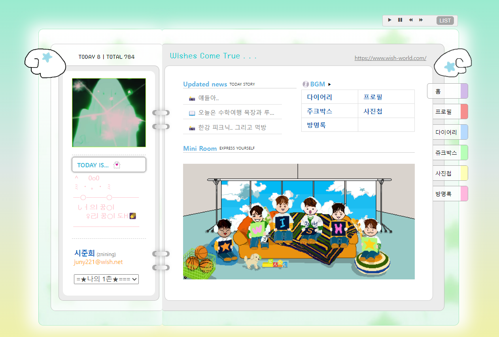

# Wish-World
```
한 줄 소개: 싸이월드 미니홈피 모작<br>
날짜: 2025년 1월 20일 → 2025년 3월 4일<br>
스킬: CSS, Firebase, HTML, JavaScript<br>
담당 기능: 개발, 기획, 배포, 설계<br>
팀 구성: 프로그래머 1명<br>
```

## 🔗 Source Code

[https://github.com/bye-on/wish-world](https://github.com/bye-on/wish-world)


## 🚩 개발 목표

- 싸이월드 미니홈피를 모작하여 웹 개발 이해 도모
- 실제 배포하여 유저 피드백 듣기
  

## 📝 프로젝트 설명
[https://wish-world-desu.web.app/](https://wish-world-desu.web.app/)

```
싸이월드 미니홈피를 모작하여 재해석한 ‘wish world’입니다. 실제 서비스했던 웹을 모작하여 프론트엔드 개발에 대한 이해를 도모하였습니다.
```

## 🔨 사용 기술

- HTML/CSS/JavaScript (Front-end)
- Firebase (Back-end)

## 🖥️ 개발 및 기여 내용

### 💜 홈



전체 UI

⇒ 전체적인 UI 모습입니다. 인덱스를 통해 ‘다이어리, 쥬크박스, 사진첩, 방명록’으로 이동 가능합니다. 현재 BGM이 자동재생되어 있으므로, 오른쪽 페이지의 내용은 iframe으로 보여지므로 음악 끊김없이 이용할 수 있습니다.

또한, Today와 Total을 통해 오늘의 사용자의 총 사용자 수를 반영하였습니다.


⇒ 순서대로 음악재생>일시정지>이전 곡 재생>다음 곡 재생>플레이리스트 입니다. 곡명 옆 버튼을 누르면 해당 곡이 재생됩니다. 음악 재생은 ‘Youtube API’를 사용하였습니다.

### 🩵 다이어리


⇒ 왼쪽 페이지에 ‘캘린더’, 오른쪽 페이지 ‘날짜 연동, 다이어리 데이터베이스 불러와 출력’을 구현하였습니다. 데이터베이스는 Firebase 사용하였습니다.

### 💚 쥬크박스


⇒ 쥬크박스를 통해 플레이리스트를 바꿀 수 있습니다. ‘배경음악 등록’ 버튼을 통해 실시간 반영이 가능합니다. 

### 💛 사진첩


⇒ 다이어리와 마찬가지로 Firebase 데이터베이스를 사용하여 내용을 출력하였습니다.

### 🩷 방명록


⇒ 방명록을 구현하여 사용자의 반응을 확인할 수 있었습니다. 실시간 데이터베이스를 통해 ‘확인’ 버튼을 누르면 댓글이 바로 반영되도록 하였습니다.

## 💡 배운 점 & 아쉬운 점

- HTML, CSS, JavaScript에 대한 이해도 향상
- 실 사용자의 피드백 확인

→ 개인 프로젝트 겸 공부를 위해 구현한 웹이었기에 설계가 제대로 이루어지지 않아 중간에 프로젝트 전체를 뒤엎는 일이 있었습니다. 처음엔 MySQL과 Express.js를 통해 서버를 직접 구현하려고 하였으나, 어려움을 느끼고 뒤늦게 Firebase를 사용하게 되었습니다. 덕분에 예상보다 늦게 프로젝트를 마감했고, 설계의 중요성을 깨닫게 되는 프로젝트였습니다.
